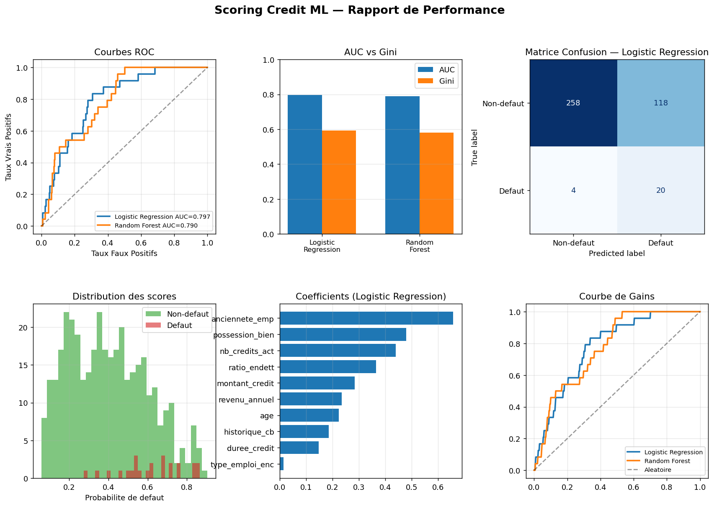

# 📊 Scoring Crédit — Pipeline ML Bancaire

Pipeline complet de machine learning pour le scoring de crédit (Probability of Default), inspiré des modèles Bâle II / Bâle III utilisés dans les banques.

## 📸 Aperçu



## 🎯 Fonctionnalités

- Génération de 5 000 clients synthétiques réalistes (revenus, endettement, historique crédit...)
- Preprocessing : encodage, imputation, normalisation (Pipeline sklearn)
- 3 modèles entraînés : Logistic Regression, Random Forest, Gradient Boosting
- Métriques bancaires : **AUC-ROC, Gini, KS-Statistic**
- Validation croisée stratifiée 5-fold
- Rapport graphique 6 panneaux (courbes ROC, matrice confusion, importance variables...)
- Scoring en temps réel d'un nouveau client
- Sauvegarde du meilleur modèle (joblib)

## 📈 Résultats obtenus

| Modèle | AUC | Gini | KS |
|--------|-----|------|----|
| **Logistic Regression** | **0.797** | **0.594** | **0.498** |
| Random Forest | 0.790 | 0.580 | 0.478 |

## 🗂️ Structure

```
scoring-credit-ml/
├── scoring_credit.py      # Pipeline principal
├── data/
│   └── credit_data.csv    # Dataset synthétique (généré auto)
├── models/
│   └── *.pkl              # Modèles sauvegardés
├── docs/
│   └── screenshot_scoring.png
├── requirements.txt
└── README.md
```

## ⚙️ Installation

```bash
pip install -r requirements.txt
```

## 🚀 Utilisation

```bash
python scoring_credit.py
```

Le script génère automatiquement les données, entraîne les modèles, affiche les métriques et ouvre le rapport graphique.

## 💡 Exemple de scoring client

```
[DEMO] Scoring d'un nouveau client :
  Probabilite de defaut : 5.23%
  Score credit          : 947/1000
  Niveau de risque      : FAIBLE
  Decision              : ACCORDE
```

## 🏦 Variables utilisées

| Variable | Description |
|----------|-------------|
| `age` | Âge du client |
| `revenu_annuel` | Revenu brut annuel (EUR) |
| `ratio_endett` | Taux d'endettement (0-1) |
| `historique_cb` | Score historique crédit (300-850) |
| `type_emploi` | CDI / CDD / Indépendant / Retraite |
| `montant_credit` | Montant demandé (EUR) |

## 🛠️ Technologies

**Python 3** · **scikit-learn** · **pandas** · **numpy** · **matplotlib** · **joblib**

## 👩‍💻 Auteure

**Vanelle Stéphanie MANGOUA DJOUSSEU** — Recherche d'alternance en IA & Systèmes Embarqués
